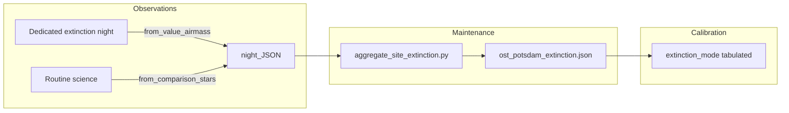

# Atmospheric extinction coefficients

How extinction is configured in the OST photometry pipeline, how to maintain
site-specific k′ values, and best practices for dedicated extinction nights.

## Three levels of coefficients

| Level | Source | When used |
|-------|--------|-----------|
| **Builtin fallback** | `DEFAULT_EXTINCTION` in code (literature, Bortle 5–6) | Last resort if no site file loads |
| **Site table** | `ost_photometry/data/ost_potsdam_extinction.json` (or custom path) | `extinction_mode="tabulated"` |
| **Per-run fit** | Fit from current data | `from_value_airmass` or `from_comparison_stars` |



## Pipeline modes (`extinction_mode`)

| Mode | Step | Coefficients |
|------|------|--------------|
| `none` | — | No correction |
| `tabulated` | — | Site JSON (bundled or `path_extinction_coefficients`) + missing filters from builtin |
| `from_comparison_stars` | — | Fit **k′** from catalog comparison stars across epochs (in calibration) |
| `from_value_airmass` | `ExtinctionFitStep` | Fit **k′** from mag/flux vs airmass; writes night JSON |

### Second-order term (`extinction_order` / `k_second`)

Fits above determine **k′ only**. To apply k″ as well:

```python
PipelineConfig(
    extinction_mode="tabulated",   # or from_comparison_stars / from_value_airmass
    extinction_order="second",
    # optional overrides (mag / airmass / mag_color):
    k_second={"B": 0.03, "V": 0.01},
)
```

With `extinction_order="second"` and no `k_second`, tabulated (or builtin) `k_second` values are used — including to enrich night fits that left `k_second=0`. Determining k″ from data remains the mk_calib campaign (`run_second_order_campaign`); a future star-wise fit is tracked in [TODO.md](TODO.md).

### Using the site table

```python
from ost_photometry.analyze.pipeline import PipelineConfig

# Default: bundled OST site file
config = PipelineConfig(extinction_mode="tabulated")

# Override path (e.g. on pollux without reinstalling the package)
config = PipelineConfig(
    extinction_mode="tabulated",
    path_extinction_coefficients="/data/ost/extinction/latest.json",
)
```

Resolution order for `tabulated`:

1. `path_extinction_coefficients` if set
2. Bundled `ost_photometry/data/ost_potsdam_extinction.json`
3. `DEFAULT_EXTINCTION` (with warning if bundled file missing)

## Maintaining the site table

### 1. Dedicated extinction nights (primary)

Run the pipeline on reduced images with:

```python
PipelineConfig(
    extinction_mode="from_value_airmass",
    skip_calibration=True,
    extinction_night_id="2026-03-15",  # optional, stored in JSON meta
)
```

Output: `extinction_coefficients.json` (wrapped format with `meta` + `coefficients`).

The auxiliary script
[`determine_extinction_coefficients.py`](https://github.com/OST-Observatory/auxiliary_scripts)
follows the same pattern.

### 2. Aggregate nights into the site file

```bash
python scripts/aggregate_site_extinction.py \
  --nights output/night1/extinction_coefficients.json \
           output/night2/extinction_coefficients.json \
  --out src/ost_photometry/data/ost_potsdam_extinction.json \
  --site OST_Potsdam \
  --plot
```

With `--plot`, QC PDFs are written next to `--out` (or under `--plot-dir`): per-filter night scatter plots (`extinction_nights_<filter>.pdf`) and a site summary bar chart (`extinction_site_summary.pdf`).

Review the printed k′ values and per-filter `n_nights`, then commit the updated
JSON or point `path_extinction_coefficients` at the output on your server.

### 3. Routine science (validation only)

`from_comparison_stars` on multi-epoch fields with airmass span can produce
night-level k′ estimates for **plausibility checks**. Prefer dedicated nights
for updating the site table.

---

## Best practice: dedicated extinction nights

**Goal:** measure the same stars over a large airmass range so the slope k′
(mag/airmass) is well determined. The pipeline requires **at least 3 measurements
per filter** (`fit_extinction_from_value_airmass`, `ExtinctionFitStep`).

### Observation requirements

| Aspect | Recommendation | Why |
|--------|----------------|-----|
| **Weather** | Clear, stable; avoid thin cloud | Transparency drift biases k′ |
| **Moon** | Moonlit nights acceptable (cat-star method) | Need bright unsaturated stars |
| **Star selection** | Several bright stars (e.g. G2V), spread over the field | Per-star fit, then average; robust to outliers |
| **Airmass span** | ΔX ≥ 0.3–0.5 per star; ideally X ≈ 1.0 … 2.0+ over the night | Small span → poorly constrained k′ |
| **Schedule** | Continuous series over several hours (rising or setting) | One airmass per image; many points along the curve |
| **Filters** | Same star series per filter; B/V/R in parallel if possible | `observation_to_extinction_fit_table` builds `mag_<filter>` columns |
| **Exposures** | Good SNR, no saturation; similar integration when possible | Noise → larger k′_err; saturation → systematics |
| **Extraction** | PSF if stars overlap; APER for simple sparse fields | `photometry_extraction_method` |
| **Tracking** | Reliable WCS + correlation (stable `id` across images) | Table needs consistent star IDs |
| **Site** | Correct `observatory_location` (default: OST) | Airmass from coordinates + JD |
| **Campaign** | Several clear nights per semester/year, then aggregate | Single nights can be outliers |

### Minimal checklist before accepting a night

1. At least **3 images per filter** at different airmasses.
2. At least **one star** with ≥ 3 valid points over ΔX (several stars is better).
3. Inspect diagnostic plots in `output_dir/diagnostics/extinction/` (linear trend, no obvious outliers).
4. Note `k_prime_err` in the night JSON; exclude nights with large errors from aggregation.

### Typical OST workflow

1. Choose an extinction field (e.g. equatorial field or standard stars).
2. For each filter, take a time series until airmass changes significantly.
3. Reduce data; run pipeline with `from_value_airmass`, `skip_calibration=True`.
4. Archive the night JSON; after a campaign run `scripts/aggregate_site_extinction.py`.
5. Use `extinction_mode="tabulated"` for routine science calibration.

### What is **not** sufficient

- Only 1–2 exposures per filter
- Constant airmass (zenith-only, no variation)
- Strongly variable transparency (cirrus, passing clouds)
- A single faint star (insufficient SNR)
- Using ordinary science fields without a dedicated airmass curve as a substitute for method A (use `from_comparison_stars` for checks instead)

### References

- [cat-star.org extinction processing](http://cat-star.org/SOCO/PROCESSING/extinction.html)
- Berry & Burnell, *Handbook of Astronomical Image Processing* (Willmann-Bell)
- [AAVSO typical second-order extinction coefficients](https://www.aavso.org/content/typical-values-2nd-order-extinction-coefficients)

---

## JSON format

**Wrapped (preferred):**

```json
{
  "meta": {
    "site": "OST_Potsdam",
    "updated": "2026-07-13",
    "method": "value_airmass",
    "n_input_nights": 5
  },
  "coefficients": {
    "V": {
      "filter_name": "V",
      "k_prime": 0.19,
      "k_prime_err": 0.02,
      "k_second": 0.01,
      "k_second_err": 0.0,
      "color_filter_1": "B",
      "color_filter_2": "V",
      "valid": true
    }
  }
}
```

**Legacy flat format** (still supported for night outputs):

```json
{
  "B": { "k_prime": 0.31, "k_prime_err": 0.03, ... }
}
```

## API

```python
from ost_photometry.analyze.extinction_io import (
    load_extinction_coefficients,
    save_extinction_coefficients,
    resolve_tabulated_extinction_coefficients,
    aggregate_extinction_coefficients,
)
```

## See also

- [PIPELINE_CONFIG.md](PIPELINE_CONFIG.md) — full pipeline option reference
- [ARCHITECTURE_AND_MIGRATION.md](ARCHITECTURE_AND_MIGRATION.md) — breaking changes and presets
